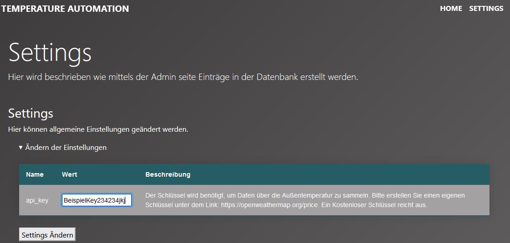

# Temperaturüberwachung mit eigenem Heim-Server

Dieses Projekt erstellt einen Server für die Heimautomation. Es können Daten über offene Schnittstellen (Rest-API) an den Server gesendet werden.

Aktuell ist nur eine Temperatur-Automation für ein lokales Netzwerk implementiert.

## Voraussetzung

- Raspberry (getestete mit Raspverry Pi B 2GB)
- Pro Sensor 3 Leitungen (+, Data, -)
- Pro Sensor ein Raspberry Pi
- Pro Sensor ein AM2302 (Temperartur und Feuchtigkeitsmesser)
- Gitlab Account, um dieses Projekt herunterladen zu können
- Der in der Shell erstellte Benutzer muss "pi" heißen. Ansonsten muss an jeder Stelle wo "/pi/" vorkommt durch "/IhrBenutzer/" ersetzt werden.

## Installation

Das Projekt steht über Git zur Verfügung und kann wiefolgt installiert werden.

### Installation Git

Zunächst muss Git auf dem Raspberry Pi mit dem angeschlossenen Sensor installiert werden. <br>
Am schnellsten geht das mit folgenden Bash Befehlen:

```
sudo apt update
sudo apt install git
```

Anschließend kann Git mit den nachstenden Zeilen konfiguriert werden:

```
git config --global user.name "Your Name"
git config --global user.email "youremail@yourdomain.com"
```

### Installation des Projektes

Für die Installation des Projektes müssen die nachstehenden Zeilen in dem Bash Terminal ausgeführt werden.

```
sudo apt-get install libgpiod2
cd /home/pi/
git clone https://git.haw-hamburg.de/acj509/temp_automation.git
sudo chmod 777 -R temp_automation
cd temp_automation/
python3 -m venv venv
source ven/bin/activate
./init_project
```

Nach diesen Zeilen wurden alle nötigen Bibliotheken geladen. Der Server kann nun erstellt werden.

### Server zum Laufen bringen

Um den Server zu installieren, müssen lediglich die nachstehenden Zeilen ausgeführt werden.

```
cd /home/pi/temp_automation/home_server
./run_deploy.sh
```

Das Programm führt alle Schritte für die Erstellung eines Django Servers aus. Dabei müssen ein paar Daten eingegeben werden. So wird beispieldweise eine Admin für die Seite erstellt. Hier muss ein Benutzername und Passwort erstellt werden.
Außerdem muss die 000-default.conf Datei bearbeit werden, sodass die Django App über die IP des Raspberry Pis aufgerufen werden kann.

Die Website kann nun aufgerufen werden, indem die IP des Raspberry Pis eingegeben wird.
Falls die IP nicht bekannt ist, kann sie über den Befehel

```
hostanme -I
```

herausgefunden werden. Geben Sie die IPv4 in einen Browser ein.

## Tabellen anlegen

Damit Daten gesammelt werden kann, müssen zunächste Einträge in die Datenbank eingetragen werden. Dazu klicken Sie bitte auf den Reiter "SETTINGS". Unter der Unterschift Tabellen können Einträge getätigt werden. Daten könne eingetragen werden indem Sie die Detailansicht aufklappen (Pfeil-Symbol anklicken). Es erscheint eine Tabelle in der Daten in Felder eingetragen werden können. Tragen Sie dort die gewünschten Daten ein und klicken Sie auf den Button in der letzten Spalte. Bitte tragen Sie die Daten in folgender Reihenfolge ein:

1. ChatBot anlegen
2. Ort anlegen
3. Raum anlegen

Mit dem aktuellen Stand ist es nicht nötig mehrere Orte anzulegen. Sollen jedoch mehrere Sensoren in jeweils anderen oder gleichen Räumen stehen, sollten mehrere Räume angelegt werden.

## OpenWeatherMap API Key Eirichten

Zu jedem angelegten Ort werden die Außentemperaturen gesammelt. Das kann jedoch nur funktionieren, wenn Sie sich einen Api Key bei der OpenWeatherMap erstellen. Dazu müssen Sie einen kostenfreien Account unter der Adresse https://openweathermap.org/ erstellen. Nach dem Erstellen eines Kontos müsste unter der Adresse https://home.openweathermap.org/api_keys ein Key zufinden sein.

Kopieren Sie diesen Schlüssel und fügen Sie diesen bei Sich in den "Settings" ein. Drücken Sie anschließend auf Settings ändern.



## Sensoren einrichten

Es können mehrere Sensoren eingerichtet werden. Es können eigene Sensoren erstellt werden oder welche die offene API Schnittstellen http://[IpServer]/api/entries/ benutzen.

Unsere Lösung kann hier heruntergladen werden: https://git.haw-hamburg.de/acj509/temp_automation_sensor

Folgen Sie den Anweisungen auf der Internetseite. Aktuell ist nur ein Sensor pro Controller vorgesehen. Dies kann natürlich durch eigene Anpassungen geändert werden.

Nachdem der Sensor initialisiert wurde, fängt dieser an Daten an den Server zu senden. Hat der Sensor die Daten an die richitge URL geschickt, findet man in den "SETTINGS" unter "Sensor anlegen" einen Tabelleneintrag. Hier muss dem Sensor ein Name gegeben, ein Raum zugeordnet und der Button daneben angeklickt werden.

## Offene Schnittstellen

Unter der Adresse: http://[IpServer]/api/ werden die möglichen offenenen Schnittstellen aufgelistet.

**Es bestehen keine großartigen Sicherheitsmaßnahmen, welshalb dieses Projekt so nicht über das Internet aufgerufen werden sollte!**

## Erweiterbarkeit

Das Projekt ist so erstellt worden, dass es möglicht einfach zu erweitern ist. Mit einem Adequaten Login-System kann die App auch über das Internet als Home-Automation aufrufbar gemacht werden. Dies müssten Sie jedoch selber machen.

## PS

Wer Rechtschreibfehler findet, kann sie für sich behalten oder ändern :P
